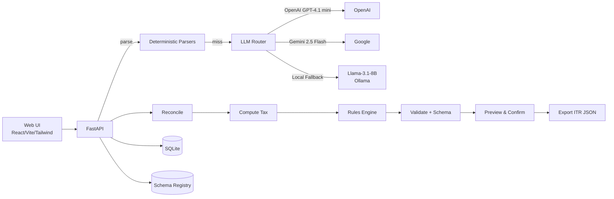
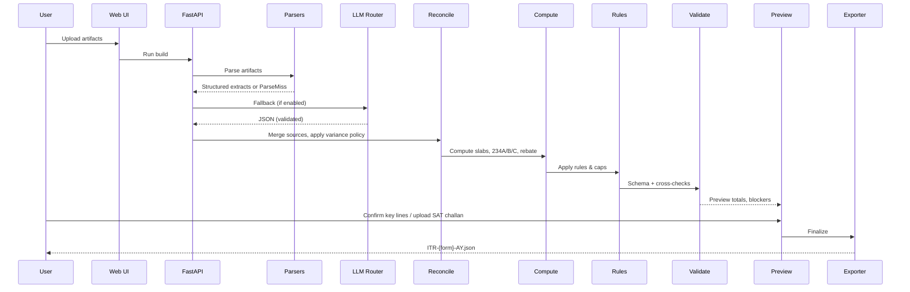

# ITR Prep — Minimal UI, Offline (Non-ERI)

A local desktop application that prepares CBDT-schema-compliant ITR JSON files for AY 2025-26 (ITR-1/2 initial support). Processes tax documents offline using deterministic parsers with LLM fallback, performs reconciliation and tax computation, applies business rules, and exports ready-to-upload JSON files. **Does not e-file or connect to income tax portal** — user uploads the generated JSON via the official Offline Utility.

## Scope & Non-Goals

**What it does:**
- Parses prefill JSON, AIS/TIS, Form 16B, bank statements, broker P&L, Form 26AS
- Reconciles data across sources with variance detection and confirmation
- Computes tax liability, TDS/TCS credits, advance tax, and rebates
- Applies 20+ business rules and schema validation
- Generates CBDT-compliant ITR JSON for portal upload

**What it does NOT do:**
- No e-filing capability
- No API integration with income tax portal
- No ERI (Electronic Return Intermediary) features
- No cloud storage or account management

## System Architecture

Small 3-tier local application with background processing pipeline. Deterministic parsers handle structured data first, with LLM fallback for complex documents. All processing offline by default.



## Data Flow (End-to-End)

1. **Upload** artifacts (prefill.json, AIS/TIS, Form 16B, bank statements, broker P&L, Form 26AS)
2. **Parse** documents using deterministic parsers, fallback to LLM if needed
3. **Reconcile** data across sources, flag variances requiring confirmation
4. **Compute** tax slabs, TDS/TCS credits (234A/B/C), rebates, and liability
5. **Apply** business rules, caps, and validation checks
6. **Review** preview with key totals, resolve any blockers
7. **Confirm** critical lines (savings interest, advance tax, TDS/TCS amounts)
8. **Tax Payment** page if liability exists, upload SAT challan if paid
9. **Export** final ITR-{form}-AY.json file
10. **Upload** JSON in official Offline Utility and e-verify on portal



## Tech Stack

| Component | Technology |
|-----------|------------|
| **Frontend** | React 18, Vite, TypeScript, Tailwind CSS |
| **Backend** | FastAPI, Pydantic v2, SQLAlchemy |
| **Database** | SQLite (local file) |
| **Parsing** | pdfplumber, pandas, regex patterns |
| **Rules/Validation** | jsonschema, custom business rules |
| **Packaging** | PyInstaller (standalone exe) |
| **LLMs** | OpenAI GPT-4.1 mini, Gemini 2.5 Flash, Llama-3.1-8B (Ollama) |

## Requirements

- **OS:** Windows 10/11 (primary), macOS (optional)
- **Python:** 3.11+
- **Node.js:** 20+
- **Git:** Latest version
- **Optional:** 
  - `make` command (install via `winget install GnuWin32.Make` or use batch scripts)
  - Tesseract (OCR): `winget install UB-Mannheim.TesseractOCR`
  - Ollama (offline LLM): Download from https://ollama.ai
- **Disk:** ≥1 GB free space
- **Memory:** ≥8 GB recommended (for local LLM)

## Installation (Development)

```cmd
git clone <repo>
cd <repo>
python -m venv .venv
.venv\Scripts\activate
pip install -r requirements.txt
cd apps\web
npm install
cd ..\..
copy .env.sample .env.local
```

**Start Development (Windows):**
```cmd
# Option 1: Use batch scripts directly
scripts\build_server.bat --dev

# Option 2: Manual start
cd apps\api
python main_packaged.py --dev --no-browser
# In another terminal:
cd apps\web
npm run dev
```

**Start Development (with make - requires installation):**
```bash
make dev
```

**URLs:**
- API docs: http://localhost:8000/docs
- Web UI: http://localhost:5173

## Configuration

### .env.local Keys

```bash
# LLM API Keys (optional - cloud LLMs disabled by default)
OPENAI_API_KEY=your_openai_api_key_here
GEMINI_API_KEY=your_gemini_api_key_here

# Local LLM (optional)
OLLAMA_BASE_URL=http://localhost:11434

# Database
DATABASE_URL=sqlite:///./tax_planner.db

# Security
SECRET_KEY=your_secret_key_here
DEBUG=true
```

### LLM Settings (Default Safe)
- Cloud LLMs: **Disabled** by default
- PII Redaction: **Enabled** (masks PAN/Aadhaar/account numbers)
- Confidence Thresholds: Conservative settings
- Workspace: `./workspace/` (SQLite DB and uploads stored here)

## Using the App

1. **Create Return** → Select ITR form (1 or 2) and assessment year
2. **Upload Artifacts** → Drag/drop prefill JSON, AIS, Form 16B, bank statements, etc.
3. **Run Build** → Process documents, parse data, reconcile sources
4. **Review & Confirm** → Verify key lines (savings interest, advance tax, TDS/TCS)
5. **Tax Payment** → If liability exists, upload SAT challan proof
6. **Rules Applied** → Review business rule results and validation status
7. **Report Preview** → Final ITR preview with all computations
8. **Export JSON** → Download ITR-{form}-AY.json file
9. **Portal Upload** → Import JSON in official Offline Utility and e-verify

## Packaging (Production Offline)

### PyInstaller (Standalone Executable)

**Windows:**
```cmd
scripts\build_server.bat
```

**With make (if installed):**
```bash
make build-server
```

Creates `dist/TaxReturnProcessor.exe` - run the executable, serves UI at http://localhost:8000

**Note:** Tauri desktop app packaging is planned but not yet implemented. Current packaging creates a standalone server executable.

## Testing

Unit tests for parsers, reconciliation, tax computation, rules engine, and JSON export. E2E tests with Playwright.

**Windows:**
```cmd
cd packages\core
python -m pytest tests\ -v
cd ..\..
cd apps\api
python -m pytest tests\ -v
cd ..\..
cd apps\web
npm test
```

**With make (if installed):**
```bash
make test
```

### Golden Fixtures
- **ITR-1 Salary-Only:** Simple refund scenario with deterministic parsing
- **ITR-2 Complex:** Multi-source income with CG, interest, 26AS, and variance handling

## Troubleshooting

| Issue | Quick Fix |
|-------|-----------|
| `make` command not found | Install: `winget install GnuWin32.Make` or use `scripts\build_server.bat` |
| PyInstaller version error | Update pip: `python -m pip install --upgrade pip` |
| Python dependencies fail | Use Python 3.11 (not 3.13), create fresh virtual environment |
| Pydantic/Rust compilation errors | Install Rust: `winget install Rustlang.Rustup` or use Python 3.11 |
| Schema validation errors | Check `logs/validation.log`, verify document formats |
| Variance blockers | Review reconciliation page, confirm disputed amounts |
| Missing OCR | Install Tesseract: `winget install UB-Mannheim.TesseractOCR` |
| LLM disabled | Enable in settings or add API keys to `.env.local` |
| Missing API keys | Cloud LLMs optional - app works offline-only |
| Port conflicts | Change ports in config or kill conflicting processes |

**Log Locations:**
- Application: `logs/app.log`
- Parsing: `logs/parsers.log`
- Validation: `logs/validation.log`

## Security & Privacy

- **Offline by Default:** No cloud calls unless explicitly enabled
- **PII Redaction:** Automatic masking of PAN/Aadhaar/account numbers before any cloud LLM call
- **Local Storage:** All data stored in local SQLite database and workspace folder
- **No Telemetry:** No usage tracking or data collection

## Legal Disclaimer

This software assists with ITR preparation only and does not constitute tax advice. Users are responsible for verifying accuracy and completeness of generated returns. Always validate the exported JSON in the official Income Tax Department's Offline Utility before e-filing on the portal.

## Changelog & Roadmap

**Current:** AY 2025-26, ITR-1/2 support, offline-first architecture

**Planned:**
- ITR-3/4 support
- Additional document parsers (Form 16A, investment statements)
- Auto-update mechanism
- Code signing for executables
- Enhanced variance detection algorithms

---

**Status:** Production-ready for ITR-1/2 AY 2025-26 | **License:** MIT | **Support:** Issues & PRs welcome